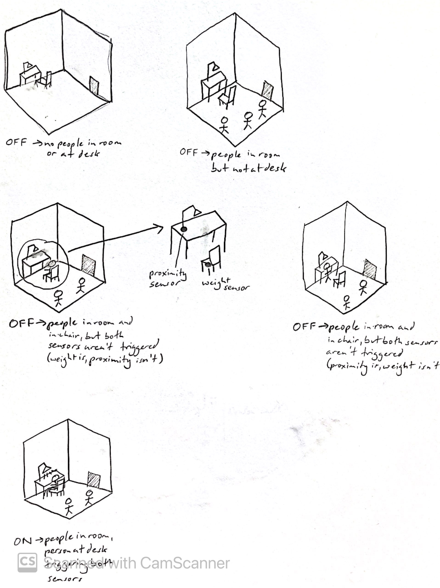
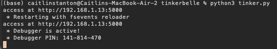
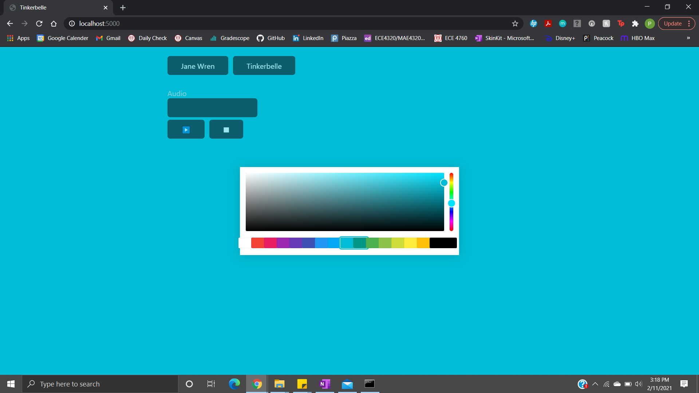
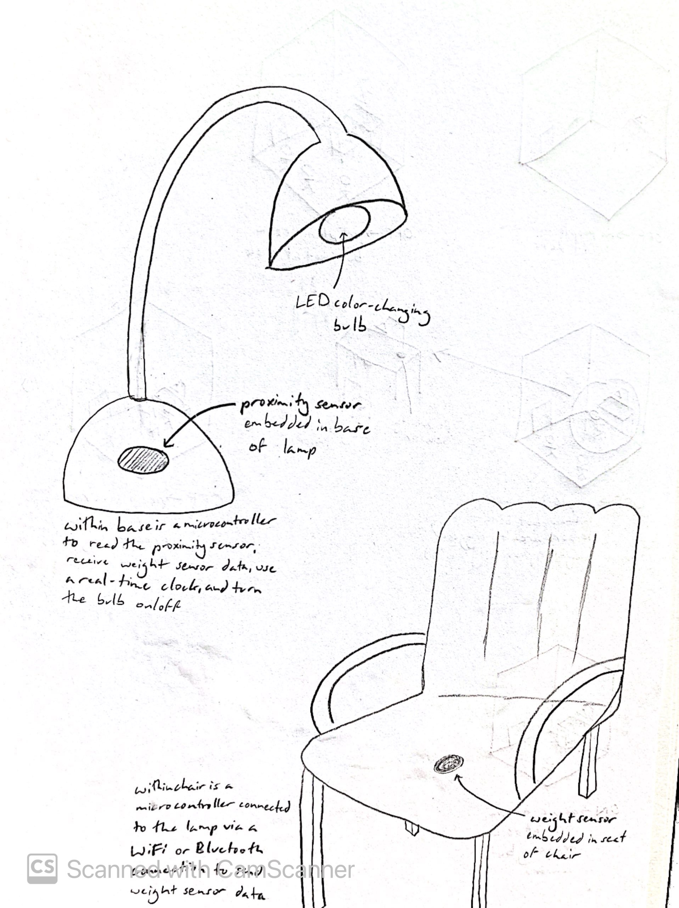

# Staging Interaction

## Overview
For this assignment, you are going to 

A) [Plan](#part-a-plan) 

B) [Act out the interaction](#part-b-act-out-the-interaction) 

C) [Prototype the device](#part-c-prototype-the-device)

D) [Wizard the device](#part-d-wizard-the-device) 

E) [Costume the device](#part-e-costume-the-device)

F) [Record the interaction](#part-f-record)

## Part A. Plan 

**Describe your setting, players, activity and goals here.**

My interactive device is a natural light desk lamp, crafted to provide a light source appropriately colored by the time of day. It will only turn on when needed by the person whose desk it sits on. This will be confirmed by connecting the lamp to an accompanying desk chair, both of which will have sensors embedded within them. A real-time clock will be tasked with determining what color light to use: earlier times will have cool-toned light, while later in the day will have warm-tone light.

This interaction is happening in a space with a desk and accompanying chair, such as an office (either at home or in a workplace), a coworking space, or a general living area. Since the interaction is utilizing a desk lamp, this device can be used during the workday at an office or workplace or at the end of the workday if it's in a home or living space.

The room may contain many people, but the main actor in question is the person whose desk the lamp is sitting on. Coworkers and clients (especially in a work environment) or family and friends (especially in a living space) may be occupying the room as well, depending on its size and furniture layout. 

The person who's directly interacting with the lamp is going to do some work at their desk. They will sit down at their desk chair, pull themselves closer to the desk, and begin working; this will turn on the lamp to assist with lighting any work they're doing. Other people in the room may be milling about, talking with the main actor, or doing their own work, but they will not be directly interacting with both the chair and the lamp unless they intend to do work at this desk.

The goal of the person directly interacting with the lamp is to complete work at their desk without eye strain. The presence of the light and its shift from cool-toned light to warmer-toned light will especially help during less naturally lit times of day.

**Include a picture of your storyboard here**

Below is a storyboard of the various scenarios people could find themselves in with my proposed device. I'll go through them from the top down, left to right. The first cube shows an empty room; the lamp is off because there is nobody present currently triggering the sensor. The next cube shows a room with people in it, but again the light is off because nobody is triggering the sensor. The third cube shows someone sitting in the desk chair, triggering the weight sensor, but the light is off; this is a scenario where the person isn't close enough to the desk to need the lamp. This scenario was something that I used to improve the device to include a secondary sensor—a proximity sensor—embedded in the base of the lamp so as to ensure someone is sitting at the desk, not just in the chair, for it to turn on. A zoom in shows thisproposed sensor layout: a proximity sensor in the base of the lamp and a weight sensor in the desk chair. The next cube shows the lamp still off because both sensors aren't triggered; in this case, the person is close enough to the desk to trigger the proximity sensor, but not the weight sensor. The last cube shows the lamp on because the person is sitting in the chair and at the desk, therefore meeting the requirements to indicate that the desk is being used.

**Summarize feedback you got here.**

The original premise involved the lamp turning off and on like a normal desk lamp, except with the added feature that the user wouldn't have to turn it on manually. The people in my breakout room (Priya Kattappurath, Jacob Rauch, Luca Spinazzola) encouraged added more interesting elements to it, particularly with color and sound. That's how I brainstormed the feature of differently toned light based on the time of day, since people are more apt to want warmer-toned light closer to nighttime so as to prevent eye strain directly before winding down for bed. At first I thought about using a light sensor to help determine what level of light the lamp should be on, but I realized that wouldn't be useful in situations when it's darker during the middle of the day (i.e. a storm) or in rooms that aren't naturally lit (since artifical light tends to be at the same strength no matter the time of day, especially in an office). A real-time clock could be loaded onto the microcontroller for this interactive device and an API tracking the sunset/sunrise of the location of the lamp could be used instead.

## Part B. Act out the Interaction

**Are there things that seemed better on paper than acted out?**

At first, the idea was that the lamp would turn on when the desk chair was compressed with weight, indicating a person was sitting down in it and ready to work. When I stood to get up, I remembered that I often use my chair to hold boxes, bags, and other items temporarily, that my chair is used for a combination of storage and sitting. Having a weight sensor alone wouldn't account for that because the weight of a box could trigger it just the same as a person, and it felt sort of invasive to have to input your weight for a desk lamp device to turn on. At least another sensor needed to be added in order to work around this use case for the desk chair.

**Are there new ideas that occur to you or your collaborators that come up from the acting?**

The original assumption was that this lamp will be used on a one-person desk, so the desk chair will be directly correlated with the desk lamp. However, in a co-working space or open office, there is the possibility that the desk lamp can be moved to another area or even simply pointed in a direction not facing the desk chair. In this case, someone sitting in the desk chair will trigger the lamp to turn on in another area or configuration. This can be solved with sensors in both the lamp and the desk chair to have more redundancy in checking if a person has sat down (a weight sensor in the desk chair) and if they're in front of the corresponding lamp (a proximity sensor on the lamp). 

## Part C. Prototype the device

**Give us feedback on Tinkerbelle.**

Unfortunately, I wasn't able to use the Tinkerbelle tool. I installed the requirements.txt items using pip3 and checked that I had a version of Python 3 installed before running python3 tinker.py. The IP address and debugging statements would print to the console, but going to http://localhost:5000 or http://192.168.1.13:5000 didn't load the page at all on my desktop or my phone. 

I changed the port number to 8888 in the case that another program was using 5000, but that didn't solve the problem. Other students recommended restarting the computer or downgrading to another version of Python 3 (or even Python 2) but now of these fixes worked. 

Thankfully, Priya Kattappurath is also taking the class. She's one of my friends and is currently in Ithaca so I was able to use her functional Tinkerbelle app for additional prototyping and the final video of my interactive device. This screenshot of the launched web server was successfully grabbed from her desktop running Tinkerbelle.

## Part D. Wizard the device

**Include your first attempts at recording the set-up video here.**

As detailed above, Tinkerbelle wasn't able to run on my device in order to control my phone from my computer. However, I was able to work with Priya to film my final video, and was able to see it in action. Here is Priya's video illustrating how the setup worked.

[Tinkerbelle Set-Up (Priya Kattappurath)](https://www.youtube.com/watch?v=0xtSLiDrbS4)

**Show the follow-up work here.**

## Part E. Costume the device

**Include sketches of what your device might look like here.**

Here is a sketch of the device; note that it encompasses two parts: a lamp and a desk chair. The lamp contains the main microcontroller responsible for turning the bulb on/off, changing the color of the light based on the real-time clock readout, receiving information from the directly connected proximity sensor, and receiving information from the desk chair. The desk chair has a smaller microcontroller embedded in the seat, along with a weight sensor. This microcontroller will be connected to the main one via WiFi or Bluetooth in order to send readings from the weight sensor.

**What concerns or opportunitities are influencing the way you've designed the device to look?**

Not much about the lamp's appearance is changed besides the addition of the proximity sensor. It's placed at the front of the base with the assumption that the majority of people will have their lamp facing forwards (as the back is typically where the power cord is connected and most people keep that hidden). 

The desk chair, however, provides multiple possible sensor orientations and their accompanying pros and cons. If the microcontroller and weight sensor are placed in the seat of the chair, the sensor will always be triggered when something/someone is in the chair but the embedded system has a higher risk of overheating or being crushed. If the embedded system is in the back of the chair, the weight sensor will only be triggered if someone leans against the back of the chair, but the system is at less of a risk of being crushed or overheating. Ultimately the former location was chosen to ensure that the weight sensor will be triggered when someone sits in the chair. 

Due to the fact that this is a two-piece device, there are considerations regarding power and communication. The lamp's microcontroller and sensor can be powered by the same voltage that powers the lightbulb, but needing the desk chair to be plugged into the wall isn't convenient. A solution is to include a battery along with the microcontroller and weight sensor in the seat of the chair. The battery would need to be durable enough to not be prone to leakage from weight being placed upon it or heating up, as well as high enough in voltage to supply the embedded system with power for a long time. A workaround for longer endurance would be making the embedded system as low power as possible by utilizing a small low-power IoT microcontroller and small weight sensor, a Bluetooth communication protocol (since WiFi requires more power for its acknowledgement packets when connecting and transmitting/receiving information), and providing functionality for a sleep mode to be enabled if the weight sensor hasn't been triggered in a certain amount of time.

Since a desk is a place that people use to do a number of things, waterproofing the desk chair (especially if the desk chair is made of breathable cloth) is necessary to keep the embedded system safe. The lamp is less of a concern because a basic lamp has a plastic or metal base to keep electronics enclosed already.

There's no need for the sensors to be brightly colored or have specific textures or use any sort of sensory design to alert the user of their presence because they're embedded in other devices and will remain hidden.

## Part F. Record

**Take a video of your prototyped interaction.**

Below is the link to a video explaining the functionality of the proposed device. It goes over how the lamp turns on/off and what basic technology/sensors are involved.

[Final Interaction](https://youtu.be/dxMwPZV3G44)

**Please indicate anyone you collaborated with on this Lab.**

Priya, Luca, and Jacob gave good feedback during our breakout room session, and Priya was very useful in filming the finished prototype.

# Staging Interaction, Part 2 

This describes the second week's work for this lab activity.

## Prep (to be done before Lab on Wednesday)

You will be assigned three partners from another group. Go to their github pages, view their videos, and provide them with reactions, suggestions & feedback: explain to them what you saw happening in their video. Guess the scene and the goals of the character. Ask them about anything that wasn’t clear. 

**Summarize feedback from your partners here.**
Grace: hey caitlin! cool product with how it's related to natural lighting (and awesome video haha).  Some feedback is maybe integrating certain modes that help the person wake up earlier or go to sleep earlier whether that is flashing its lights to indicate that so the person is forced to just start work early or end work early

^just a thought/idea cuz low key need that in my life rn haha

Sujith: Hey Caitlin I looked through your Github page and I thought your idea was really cool. I thought it could also be neat if you could implement a mood based lighting scheme as well. So if a person is super anxious for instance, maybe the light could change to a cooler tone to help calm the person down.

Priya: feedback!: kinda of an idea for an extension to your idea, that could be used in an office-type space, would be if the intensity of the light changes based on how busy/available the person is. So during the day the light would still change from cooler to warmer tones, but would be less bright if the person is super busy and has alot of deadlines or something the light is dimmer so other people in the office know to not bother them

Erin: The video is very clear about the goals and the activities. I really like your idea of changing the light color based on a real-time clock. To build upon this project, one thing I can think of is to add voice control to manually change the colors of the light or to turn on/off the light, and use gesture control to change the light intensity.

## Make it your own

Do last week’s assignment again, but this time: 
1) It doesn’t have to (just) use light, 
2) You can use any modality (e.g., vibration, sound) to prototype the behaviors, 
3) We will be grading with an emphasis on creativity. 

**Document everything here.**
