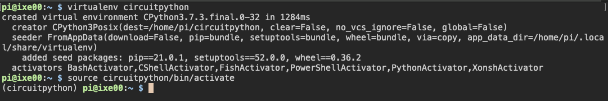
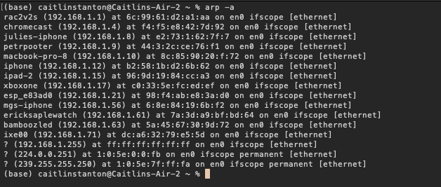
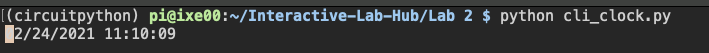
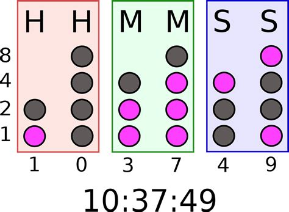

# The Clock of Pi

Does it feel like time is moving strangely during the pandemic?

For our first Pi project, we will pay homage to the [timekeeping devices of old](https://en.wikipedia.org/wiki/History_of_timekeeping_devices) by making simple clocks.

It is worth spending a little time thinking about how you mark time, and what would be useful in a clock of your own design.

**Please indicate anyone you collaborated with on this Lab here.**
Be generous in acknowledging their contributions! And also recognizing any other influences (e.g. from YouTube, Github, Twitter) that informed your design. 

I worked with Priya Kattapurath on this lab. We used pair programming every step of the way and took equal roles in debugging the software and hardware elements of this lab.

## Overview
For this assignment, you are going to 

A) [Connect to your Pi](#part-a)  

B) [Try out cli_clock.py](#part-b) 

C) [Set up your RGB display](#part-c)

D) [Try out clock_display_demo](#part-d) 

E) [Modify the code to make the display your own](#part-e)

F) [Make a short video of your modified barebones PiClock](#part-f)

G) [Sketch and brainstorm further interactions and features you would like for your clock for Part 2.](#part-g)

## The Report
This readme.md page in your own repository should be edited to include the work you have done. You can delete everything but the headers and the sections between the **stars**. Write the answers to the questions under the starred sentences. Include any material that explains what you did in this lab hub folder, and link it in the readme.

Labs are due on Mondays. Make sure this page is linked to on your main class hub page.

## Part A. 
## Connect to your Pi
Just like you did in the lab prep, ssh on to your pi. Once there create a Python environment.

```
ssh pi@ixe00
pi@ixe00:~ $ virtualenv circuitpython
pi@ixe00:~ $ source circuitpython/bin/activate
(circuitpython) pi@ixe00:~ $ 

```

Here's a screenshot of the installed virtual environment.



Here's a screenshot of the devices connected to the WiFi network, including the Pi at ixe00. `wpa_supplicant.conf` is uploaded to this repo.



## Part B. 
### Try out the Command Line Clock
Clone the repo for this assignment

```
(circuitpython) pi@ixe00:~$ git clone https://github.com/YOURGITID/Interactive-Lab-Hub.git
(circuitpython) pi@ixe00:~$ cd Interactive-Lab-Hub/Lab\ 2/
(circuitpython) pi@ixe00:~/Interactive-Lab-Hub $ 
```

Install the packages from the requirements.txt and run the example

```
(circuitpython) pi@ixe00:~/Interactive-Lab-Hub $ pip install -r requirements.txt
(circuitpython) pi@ixe00:~/Interactive-Lab-Hub/Lab 2 $ python cli_clock.py 
02/24/2021 11:20:49
```
you can press `ctrl-c` to exit.
If you're unfamiliar with the Python code in `cli_clock.py` have a look at [this Python refresher](https://hackernoon.com/intermediate-python-refresher-tutorial-project-ideas-and-tips-i28s320p). If you're still concerned, please reach out to the teaching staff!

Here's what the terminal clock looked like after running `cli_clock.py`.



## Part C. 
## Set up your RGB Display
We will introduce you to the [Adafruit MiniPiTFT](https://www.adafruit.com/product/4393) and Python on the Pi.


The Raspberry Pi 4 has a variety of interfacing options. When you plug the pi in the red power LED turns on. Any time the SD card is accessed the green LED flashes. It has standard USB ports and HDMI ports. Less familiar it has a set of 20x2 pin headers that allow you to connect a various peripherals.


To learn more about any individual pin and what it is for go to [pinout.xyz](https://pinout.xyz/pinout/3v3_power) and click on the pin. Some terms may be unfamiliar but we will go over the relevant ones as they come up.

### Hardware

From your kit take out the display and the [Raspberry Pi 4](https://www.adafruit.com/product/4296 | width=200)

Line up the screen and press it on the headers. The hole in the screen should match up with the hole on the raspberry pi.

<p float="left">


</p>

#### Testing your Screen

The display uses a communication protocol called [SPI](https://www.circuitbasics.com/basics-of-the-spi-communication-protocol/) to speak with the raspberry pi. We won't go in depth in this course over how SPI works. The port on the bottom of the display connects to the SDA and SCL pins used for the I2C communication protocol which we will cover later. GPIO (General Purpose Input/Output) pins 23 and 24 are connected to the two buttons on the left. GPIO 22 controls the display backlight.

We can test it by typing 
```
python screen_test.py
```

You can type the name of a color then press either of the buttons to see what happens on the display. Take a look at the code with
```
cat screen_test.py
```

#### Displaying Info
You can look in `stats.py` for how to display text on the screen

#### Displaying an image

You can look in `image.py` for an example of how to display an image on the screen. Can you make it switch to another image when you push one of the buttons?


## Part D. 
## Set up the Display Clock Demo

In `screen_clock.py`. Show the time by filling in the while loop. You can use the code in `cli_clock.py` and `stats.py` to figure this out.


## Part E.
## Modify the barebones clock to make it your own

Does time have to be linear?  How do you measure a year? [In daylights? In midnights? In cups of coffee?](https://www.youtube.com/watch?v=wsj15wPpjLY)

Can you make time interactive? You can look in `screen_test.py` for examples for how to use the buttons.

Here's a working version of the piTFT text clock:

[Text clock](https://youtu.be/zshAuEnRCOE)

**A copy of your code should be in your Lab 2 Github repo.**

We made a binary clock where the user can change the background color (to some extent). The binary clock conversion function is based on code from [this repo](https://gist.github.com/psimonyi/2856099). The user input for background color is from `screen_test.py`, but is slightly different in that the piTFT doesn't listen to the user directly. Instead it displays a background that's the opposite color on the color wheel, i.e. an input of red will show green. This clock keeps the user on their toes, both with the binary conversion and the reverse coloring.

The code for this can be found in `binaryclock_pt1.py`.

## Part F. 
## Make a short video of your modified barebones PiClock

**Take a video of your PiClock.**

Here's a video of the final product: [wacky binary clock](https://youtu.be/pcTb6At5QW4)

## Part G. 
## Sketch and brainstorm further interactions and features you would like for your clock for Part 2.

I'd like to incorporate the buttons to allow the user to toggle to a normal clock display if the binary clock gets a little tiring. I'd also potentially like a normal coloring scheme as well, so the user can legitimately configure the background color of the piTFT. Lastly, I'd like to make the binary clock more visually appealing with symbols rather than text, as seen in the example picture below:



## Prep for Part 2

1. Pick up remaining parts for kit.

2. Look at and give feedback on the Part G. for at least 2 other people in the class (and get 2 people to comment on your Part G!)

# Lab 2 Part 2

Working off the code from part 1, we built a joystick controlled clock with two modes: binary clock and normal 24-hour clock. It utilizes a Sparkfun QWIIC joystick and mini piTFT for hardware components, and relies on webcolors, I2C communication, and a finite state machine (FSM) on the software side. The program is written in `binaryclock_pt2.py`.

The clock has three states: colored screen, binary clock, and 24-hour clock. Once the python script is run, the user is prompted to input a color, which is translated to RGB using webcolors and used as the screen background. The system then enters the middle state to show a screen with the user's chosen color. The joystick toggles between the states of the system: if the user pulls it to the left from the middle state it enters the binary clock mode, and if the user pulls it to the right from the middle state it enters the 24-hour clock mode. All three states can be entered by the user through left and right motions of the joystick, and the state will remain on the screen once the joystick stops moving.

The main resource we used for figuring out how to initialize and acquire information from the joystick was from [Sparkfun themselves](https://github.com/sparkfun/Qwiic_Joystick). For the joystick to be used, I2C communication was enabled on the Pi. The joystick's default I2C address is 0x20, which was confirmed by running `i2cdetect -y 1` and seeing 20 noted in the list of I2C connections to the Pi. Running this command required installing i2ctools through [this tutorial](https://learn.sparkfun.com/tutorials/qwiic-hat-for-raspberry-pi-hookup-guide). We checked the functionality of the joystick with these [Python examples](https://github.com/sparkfun/Qwiic_Joystick/tree/master/Firmware/Python%20Examples), specifically focusing on `Qwiic_Joystick.py` which translated joystick movements to XY motion.

The primary obstacle we faced was learning how to interface with the joystick. It took some digging to find the Sparkfun approved Github repository of documentation (originally we looked at [this one](https://github.com/fourstix/Sparkfun_CircuitPython_QwiicJoystick) which didn't use the I2C communication capabilities of the joystick properly and wouldn't even run on the Pi, no matter how thoroughly we followed the installation instructions). Another obstacle we faced was developing the FSM, since we needed to determine the number of states, their transitions, and how those both translated into code.

A demo of our joystick controlled clock can be found [here](https://youtu.be/e2PmnGNMeks).
